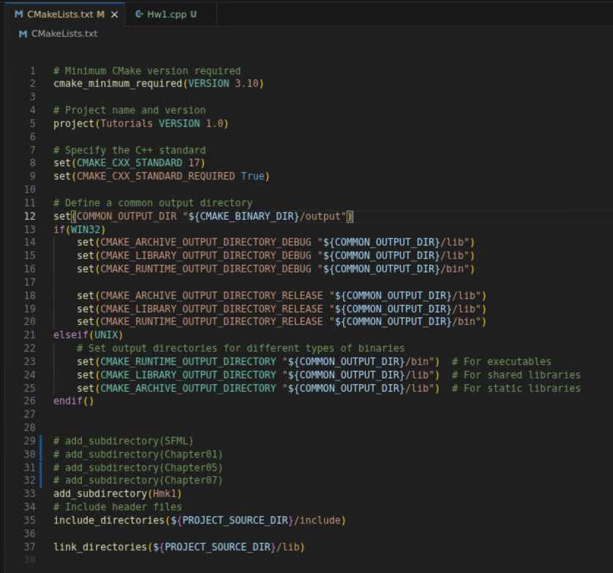

# Maze Generator and Solver

This application has been tested locally and on pace ice.

## Building on Pace ICE

To run this on pace ice in the `ECE4122-6122-SFML` github repo, the CMakelist.txt needs to be modified at the root.  All that needs to change is commenting out `add_subdirectory(SFML)`.  I do comment all subdirectory's that are not HW1 specifically, but only the SFML is required.



This is because SFML is being fetched in this Homework1 [CMakeLists.txt](./CMakeLists.txt)

```cmake
# Declare SFML from GitHub
FetchContent_Declare(SFML-GIT
    GIT_REPOSITORY https://github.com/SFML/SFML
    GIT_TAG 2.6.2
    GIT_SHALLOW ON
)
set(SFML_BUILD_AUDIO OFF CACHE BOOL "")  # We only need graphics, window, and system modules
# Download and make SFML available
FetchContent_MakeAvailable(SFML-GIT)
```

Once that is completed, then your normal `cmake ..\` and `cmake --build . -j 8` commands work as expected.

This application will look for Font either in the cwd/Font or where the executable_dir is located.

This means you can run ./build/output/bin/Hw1 without having to change directories.


## Building from ECE-6122 repository (my personal repo)

At the root dir run `make build/release` and then execute via `./build/output/bin/Hw1`

This is the CMakeList.txt file at my root directory

```cmake
cmake_minimum_required(VERSION 3.22)
project(ECE6122 LANGUAGES CXX)

# Set C++ standard globally
set(CMAKE_CXX_STANDARD 17)
set(CMAKE_CXX_STANDARD_REQUIRED ON)

# Define a common output directory
set(COMMON_OUTPUT_DIR "${CMAKE_BINARY_DIR}/output")
if(WIN32)
    set(CMAKE_ARCHIVE_OUTPUT_DIRECTORY_DEBUG "${COMMON_OUTPUT_DIR}/lib")
    set(CMAKE_LIBRARY_OUTPUT_DIRECTORY_DEBUG "${COMMON_OUTPUT_DIR}/lib")
    set(CMAKE_RUNTIME_OUTPUT_DIRECTORY_DEBUG "${COMMON_OUTPUT_DIR}/bin")

    set(CMAKE_ARCHIVE_OUTPUT_DIRECTORY_RELEASE "${COMMON_OUTPUT_DIR}/lib")
    set(CMAKE_LIBRARY_OUTPUT_DIRECTORY_RELEASE "${COMMON_OUTPUT_DIR}/lib")
    set(CMAKE_RUNTIME_OUTPUT_DIRECTORY_RELEASE "${COMMON_OUTPUT_DIR}/bin")
elseif(UNIX)
    # Set output directories for different types of binaries
    set(CMAKE_RUNTIME_OUTPUT_DIRECTORY "${COMMON_OUTPUT_DIR}/bin")  # For executables
    set(CMAKE_LIBRARY_OUTPUT_DIRECTORY "${COMMON_OUTPUT_DIR}/lib")  # For shared libraries
    set(CMAKE_ARCHIVE_OUTPUT_DIRECTORY "${COMMON_OUTPUT_DIR}/lib")  # For static libraries
endif()

# Add compiler warnings globally
if(CMAKE_CXX_COMPILER_ID MATCHES "GNU|Clang")
    add_compile_options(-Wall -Wextra -pedantic)
endif()

add_subdirectory(Homework_0)
add_subdirectory(Homework_1)

include_directories(${PROJECT_SOURCE_DIR}/include)
link_directories(${PROJECT_SOURCE_DIR}/lib)
```
