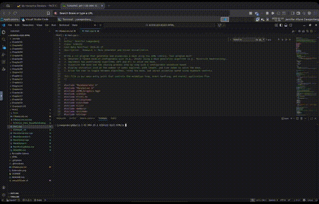

# Maze Generator and Solver

This application has been tested locally and on pace ice.

## General Info

The Time measurement shown in the maze displace is only measuring the time of the execution of the step specifically.   Because there are other loops and conditional code happening outside of each MazeSolver algorithm, to be able to compare the speed of that MazeSolver directly, we are measuring precisely the step call.

## Building on Pace ICE 

### Within this repo or shared zip file
>[!Important]
> You don't need to copy this folder to ECE4122-6122-SFML it will run as a standalone setup for ease and portability


This project cmake for Homework1 [CMakeLists.txt](./CMakeLists.txt) Fetches SFML from git directly via

```cmake
# Declare SFML from GitHub
FetchContent_Declare(SFML-GIT
    GIT_REPOSITORY https://github.com/SFML/SFML
    GIT_TAG 2.6.2
    GIT_SHALLOW ON
)
set(SFML_BUILD_AUDIO OFF CACHE BOOL "")  # We only need graphics, window, and system modules
# Download and make SFML available
FetchContent_MakeAvailable(SFML-GIT)
```

At the root of directory you only need to run either

```shell
cd build 
cmake ../ 
cmake --build . -j 8`

# or 
make build/release
```
A empty build directory is included for convenience.


### With `ECE4122-6122-SFML`

To run this on pace ice in the `ECE4122-6122-SFML` github repo, the CMakelist.txt needs to be modified at the root.  All that needs to change is commenting out `add_subdirectory(SFML)`.  I do comment all subdirectory's that are not HW1 specifically, but only the SFML is required.

```cmake
# Minimum CMake version required
cmake_minimum_required(VERSION 3.10)

# Project name and version
project(Tutorials VERSION 1.0)

# Specify the C++ standard
set(CMAKE_CXX_STANDARD 17)
set(CMAKE_CXX_STANDARD_REQUIRED True)

# Define a common output directory
set(COMMON_OUTPUT_DIR "${CMAKE_BINARY_DIR}/output")
if(WIN32)
    set(CMAKE_ARCHIVE_OUTPUT_DIRECTORY_DEBUG "${COMMON_OUTPUT_DIR}/lib")
    set(CMAKE_LIBRARY_OUTPUT_DIRECTORY_DEBUG "${COMMON_OUTPUT_DIR}/lib")
    set(CMAKE_RUNTIME_OUTPUT_DIRECTORY_DEBUG "${COMMON_OUTPUT_DIR}/bin")

    set(CMAKE_ARCHIVE_OUTPUT_DIRECTORY_RELEASE "${COMMON_OUTPUT_DIR}/lib")
    set(CMAKE_LIBRARY_OUTPUT_DIRECTORY_RELEASE "${COMMON_OUTPUT_DIR}/lib")
    set(CMAKE_RUNTIME_OUTPUT_DIRECTORY_RELEASE "${COMMON_OUTPUT_DIR}/bin")
elseif(UNIX)
    # Set output directories for different types of binaries
    set(CMAKE_RUNTIME_OUTPUT_DIRECTORY "${COMMON_OUTPUT_DIR}/bin")  # For executables
    set(CMAKE_LIBRARY_OUTPUT_DIRECTORY "${COMMON_OUTPUT_DIR}/lib")  # For shared libraries
    set(CMAKE_ARCHIVE_OUTPUT_DIRECTORY "${COMMON_OUTPUT_DIR}/lib")  # For static libraries
endif()


# add_subdirectory(SFML)
# add_subdirectory(Chapter01)
# add_subdirectory(Chapter05)
# add_subdirectory(Chapter07)
add_subdirectory(Homework_1)
# Include header files
include_directories(${PROJECT_SOURCE_DIR}/include)

link_directories(${PROJECT_SOURCE_DIR}/lib)
```
I've also included [this file](../CMakeLists-ECE4122-6122.txt) that will need to be renamed to replace the root CMakeLists.txt

This is because SFML is being fetched in this Homework1 [CMakeLists.txt](./CMakeLists.txt)

```cmake
# Declare SFML from GitHub
FetchContent_Declare(SFML-GIT
    GIT_REPOSITORY https://github.com/SFML/SFML
    GIT_TAG 2.6.2
    GIT_SHALLOW ON
)
set(SFML_BUILD_AUDIO OFF CACHE BOOL "")  # We only need graphics, window, and system modules
# Download and make SFML available
FetchContent_MakeAvailable(SFML-GIT)
```

Once that is completed, then your normal `cmake ..\` and `cmake --build . -j 8` commands work as expected.

This application will look for Font either in the cwd/Font or where the executable_dir is located.

This means you can run ./build/output/bin/Hw1 without having to change directories.



