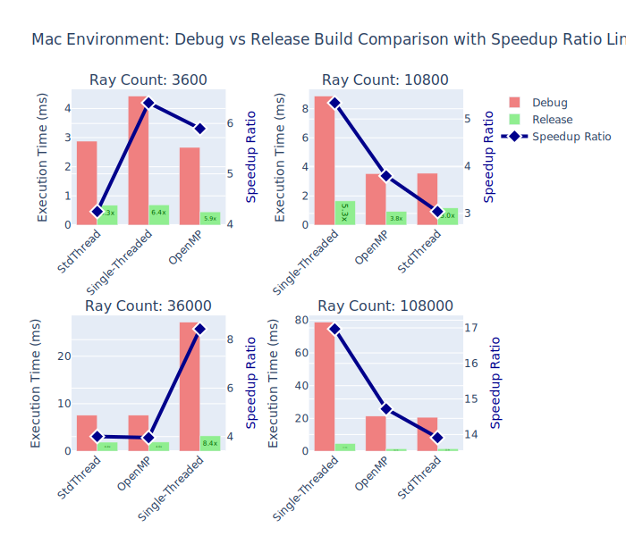
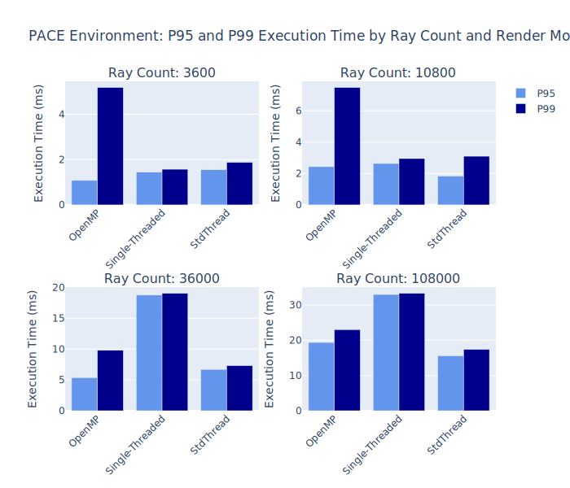
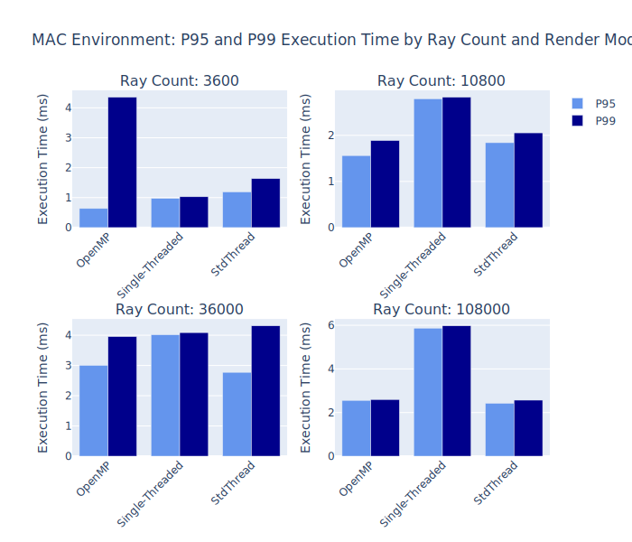
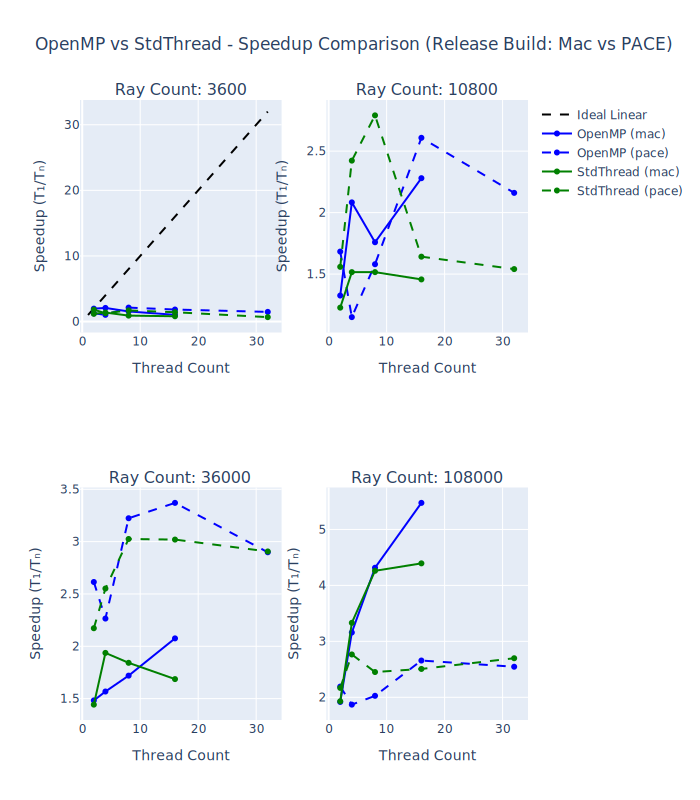
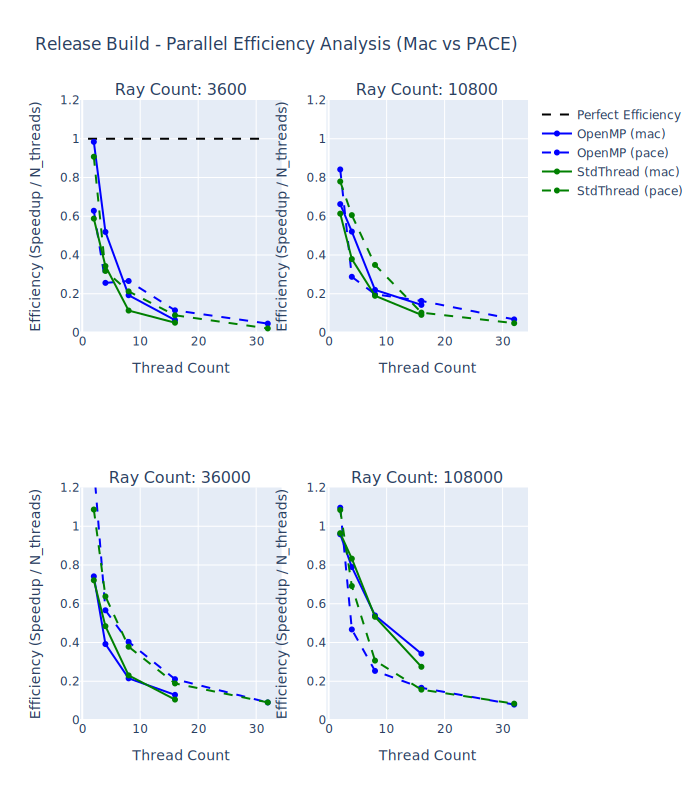

# Homework 2 Report - Jennifer Cwagenberg

## Performance Analysis

These tables were taken created from sampling 100 data points for each combination of ray count, thread count, build
type, and render mode. The speedup for OpenMP and StdThread is calculated by dividing the single-threaded execution
time by the execution time of the respective parallel implementation.

### Timing Tables

#### MacBook Environment Performance Summary

| mode | rayCnt | threadCnt | env | build | avgMs | minMs | maxMs | p95Ms | p99Ms | SampleCnt |
| --- | --- | --- | --- | --- | --- | --- | --- | --- | --- | --- |
| OpenMP | 3600 | 2 | mac | Debug | 3.01 | 1.55 | 4.43 | 3.89 | 4.16 | 101 |
| OpenMP | 3600 | 4 | mac | Debug | 2.71 | 1.15 | 9.77 | 4.34 | 5.12 | 101 |
| OpenMP | 3600 | 8 | mac | Debug | 2.21 | 0.65 | 5.81 | 3.42 | 4.88 | 101 |
| OpenMP | 3600 | 16 | mac | Debug | 2.72 | 0.53 | 26.37 | 3.77 | 7.38 | 101 |
| OpenMP | 3600 | 2 | mac | Release | 0.35 | 0.09 | 1.13 | 0.64 | 1.06 | 101 |
| OpenMP | 3600 | 4 | mac | Release | 0.33 | 0.06 | 4.36 | 0.55 | 1.12 | 101 |
| OpenMP | 3600 | 8 | mac | Release | 0.45 | 0.08 | 9.95 | 0.57 | 1.47 | 101 |
| OpenMP | 3600 | 16 | mac | Release | 0.67 | 0.12 | 11.58 | 0.8 | 6.93 | 101 |
| OpenMP | 10800 | 2 | mac | Debug | 5.02 | 4.25 | 5.77 | 5.52 | 5.77 | 101 |
| OpenMP | 10800 | 4 | mac | Debug | 3.75 | 2.47 | 4.4 | 4.0 | 4.33 | 101 |
| OpenMP | 10800 | 8 | mac | Debug | 2.79 | 1.66 | 4.37 | 3.71 | 4.1 | 101 |
| OpenMP | 10800 | 16 | mac | Debug | 2.56 | 1.47 | 5.27 | 3.3 | 4.85 | 101 |
| OpenMP | 10800 | 2 | mac | Release | 1.25 | 0.27 | 3.1 | 1.66 | 1.8 | 101 |
| OpenMP | 10800 | 4 | mac | Release | 0.8 | 0.15 | 1.89 | 1.48 | 1.59 | 101 |
| OpenMP | 10800 | 8 | mac | Release | 0.94 | 0.21 | 6.88 | 1.56 | 4.47 | 101 |
| OpenMP | 10800 | 16 | mac | Release | 0.73 | 0.16 | 1.46 | 1.2 | 1.45 | 101 |
| OpenMP | 36000 | 2 | mac | Debug | 14.17 | 13.79 | 14.94 | 14.36 | 14.73 | 101 |
| OpenMP | 36000 | 4 | mac | Debug | 7.61 | 7.43 | 7.85 | 7.82 | 7.84 | 101 |
| OpenMP | 36000 | 8 | mac | Debug | 4.59 | 3.78 | 8.52 | 5.26 | 6.55 | 101 |
| OpenMP | 36000 | 16 | mac | Debug | 3.89 | 3.48 | 4.88 | 4.62 | 4.74 | 101 |
| OpenMP | 36000 | 2 | mac | Release | 2.17 | 0.86 | 12.18 | 3.0 | 3.98 | 101 |
| OpenMP | 36000 | 4 | mac | Release | 2.05 | 0.46 | 20.4 | 3.33 | 3.96 | 101 |
| OpenMP | 36000 | 8 | mac | Release | 1.87 | 0.3 | 10.93 | 2.76 | 3.7 | 101 |
| OpenMP | 36000 | 16 | mac | Release | 1.55 | 0.29 | 3.83 | 2.68 | 3.74 | 101 |
| OpenMP | 108000 | 2 | mac | Debug | 42.97 | 42.24 | 44.6 | 43.71 | 43.88 | 101 |
| OpenMP | 108000 | 4 | mac | Debug | 22.37 | 21.9 | 22.83 | 22.54 | 22.69 | 101 |
| OpenMP | 108000 | 8 | mac | Debug | 11.15 | 10.86 | 14.62 | 11.82 | 14.62 | 101 |
| OpenMP | 108000 | 16 | mac | Debug | 9.06 | 8.36 | 10.56 | 9.48 | 10.41 | 101 |
| OpenMP | 108000 | 2 | mac | Release | 2.42 | 2.34 | 2.61 | 2.6 | 2.61 | 101 |
| OpenMP | 108000 | 4 | mac | Release | 1.47 | 1.3 | 2.59 | 1.83 | 1.85 | 101 |
| OpenMP | 108000 | 8 | mac | Release | 1.08 | 0.76 | 1.71 | 1.26 | 1.34 | 101 |
| OpenMP | 108000 | 16 | mac | Release | 0.85 | 0.74 | 1.1 | 0.97 | 1.08 | 101 |
| Single-Threaded | 3600 | 1 | mac | Debug | 4.42 | 2.87 | 5.23 | 4.86 | 5.11 | 101 |
| Single-Threaded | 3600 | 1 | mac | Release | 0.69 | 0.17 | 1.12 | 0.97 | 1.03 | 101 |
| Single-Threaded | 10800 | 1 | mac | Debug | 8.87 | 8.36 | 9.65 | 9.0 | 9.1 | 101 |
| Single-Threaded | 10800 | 1 | mac | Release | 1.66 | 0.49 | 2.86 | 2.79 | 2.83 | 101 |
| Single-Threaded | 36000 | 1 | mac | Debug | 27.17 | 25.79 | 27.73 | 27.51 | 27.68 | 101 |
| Single-Threaded | 36000 | 1 | mac | Release | 3.22 | 1.49 | 4.15 | 4.02 | 4.09 | 101 |
| Single-Threaded | 108000 | 1 | mac | Debug | 78.74 | 77.06 | 82.72 | 80.45 | 81.9 | 101 |
| Single-Threaded | 108000 | 1 | mac | Release | 4.64 | 4.42 | 6.0 | 5.87 | 5.97 | 101 |
| StdThread | 3600 | 2 | mac | Debug | 3.37 | 1.57 | 4.92 | 4.12 | 4.25 | 101 |
| StdThread | 3600 | 4 | mac | Debug | 2.74 | 0.88 | 8.03 | 3.99 | 5.54 | 101 |
| StdThread | 3600 | 8 | mac | Debug | 2.89 | 0.46 | 7.79 | 4.7 | 5.09 | 101 |
| StdThread | 3600 | 16 | mac | Debug | 2.51 | 0.84 | 4.79 | 3.66 | 3.92 | 101 |
| StdThread | 3600 | 2 | mac | Release | 0.59 | 0.14 | 1.21 | 0.93 | 1.14 | 101 |
| StdThread | 3600 | 4 | mac | Release | 0.5 | 0.12 | 1.06 | 0.83 | 1.05 | 101 |
| StdThread | 3600 | 8 | mac | Release | 0.76 | 0.14 | 2.21 | 1.15 | 1.63 | 101 |
| StdThread | 3600 | 16 | mac | Release | 0.85 | 0.19 | 2.82 | 1.48 | 1.83 | 101 |
| StdThread | 10800 | 2 | mac | Debug | 5.48 | 4.36 | 5.89 | 5.75 | 5.8 | 101 |
| StdThread | 10800 | 4 | mac | Debug | 3.63 | 2.35 | 4.26 | 4.07 | 4.22 | 101 |
| StdThread | 10800 | 8 | mac | Debug | 2.61 | 1.37 | 7.44 | 3.6 | 6.56 | 101 |
| StdThread | 10800 | 16 | mac | Debug | 2.52 | 1.11 | 4.7 | 3.22 | 4.64 | 101 |
| StdThread | 10800 | 2 | mac | Release | 1.35 | 0.3 | 2.24 | 1.83 | 2.08 | 101 |
| StdThread | 10800 | 4 | mac | Release | 1.1 | 0.28 | 2.04 | 1.79 | 2.04 | 101 |
| StdThread | 10800 | 8 | mac | Release | 1.1 | 0.19 | 2.65 | 1.93 | 2.26 | 101 |
| StdThread | 10800 | 16 | mac | Release | 1.14 | 0.28 | 2.05 | 1.81 | 2.0 | 101 |
| StdThread | 36000 | 2 | mac | Debug | 14.37 | 13.63 | 14.72 | 14.62 | 14.69 | 101 |
| StdThread | 36000 | 4 | mac | Debug | 7.51 | 7.27 | 7.72 | 7.69 | 7.72 | 101 |
| StdThread | 36000 | 8 | mac | Debug | 4.62 | 3.87 | 4.92 | 4.87 | 4.92 | 101 |
| StdThread | 36000 | 16 | mac | Debug | 3.75 | 3.3 | 4.39 | 4.03 | 4.18 | 101 |
| StdThread | 36000 | 2 | mac | Release | 2.23 | 1.48 | 3.02 | 2.59 | 2.77 | 101 |
| StdThread | 36000 | 4 | mac | Release | 1.66 | 0.53 | 4.57 | 2.98 | 4.31 | 101 |
| StdThread | 36000 | 8 | mac | Release | 1.75 | 0.41 | 4.77 | 2.69 | 3.22 | 101 |
| StdThread | 36000 | 16 | mac | Release | 1.91 | 0.41 | 7.08 | 2.8 | 5.81 | 101 |
| StdThread | 108000 | 2 | mac | Debug | 40.39 | 39.61 | 42.58 | 40.94 | 41.22 | 101 |
| StdThread | 108000 | 4 | mac | Debug | 21.73 | 21.53 | 22.38 | 21.97 | 22.34 | 101 |
| StdThread | 108000 | 8 | mac | Debug | 11.34 | 11.19 | 13.08 | 11.38 | 12.64 | 101 |
| StdThread | 108000 | 16 | mac | Debug | 9.23 | 8.14 | 10.46 | 10.3 | 10.32 | 101 |
| StdThread | 108000 | 2 | mac | Release | 2.41 | 2.35 | 2.83 | 2.56 | 2.58 | 101 |
| StdThread | 108000 | 4 | mac | Release | 1.39 | 1.36 | 1.52 | 1.43 | 1.52 | 101 |
| StdThread | 108000 | 8 | mac | Release | 1.09 | 0.73 | 1.3 | 1.22 | 1.28 | 101 |
| StdThread | 108000 | 16 | mac | Release | 1.06 | 0.71 | 3.94 | 1.77 | 2.1 | 101 |

### Pace Environment Performance Summary

| mode | rayCnt | threadCnt | env | build | avgMs | minMs | maxMs | p95Ms | p99Ms | SampleCnt |
| --- | --- | --- | --- | --- | --- | --- | --- | --- | --- | --- |
| OpenMP | 3600 | 2 | pace | Release | 0.76 | 0.45 | 1.03 | 1.02 | 1.03 | 100 |
| OpenMP | 3600 | 4 | pace | Release | 0.93 | 0.24 | 7.49 | 5.19 | 5.69 | 100 |
| OpenMP | 3600 | 8 | pace | Release | 0.45 | 0.25 | 1.09 | 0.82 | 1.0 | 100 |
| OpenMP | 3600 | 16 | pace | Release | 0.52 | 0.3 | 1.37 | 0.96 | 1.1 | 100 |
| OpenMP | 3600 | 32 | pace | Release | 0.65 | 0.32 | 1.2 | 0.87 | 1.0 | 100 |
| OpenMP | 10800 | 2 | pace | Release | 1.52 | 1.36 | 2.39 | 2.1 | 2.32 | 100 |
| OpenMP | 10800 | 4 | pace | Release | 2.23 | 0.69 | 10.42 | 7.49 | 8.53 | 100 |
| OpenMP | 10800 | 8 | pace | Release | 1.62 | 1.1 | 2.43 | 1.86 | 2.4 | 100 |
| OpenMP | 10800 | 16 | pace | Release | 0.98 | 0.73 | 1.36 | 1.25 | 1.3 | 100 |
| OpenMP | 10800 | 32 | pace | Release | 1.19 | 0.82 | 4.23 | 1.62 | 2.44 | 100 |
| OpenMP | 36000 | 2 | pace | Release | 4.56 | 4.42 | 16.33 | 4.47 | 4.7 | 100 |
| OpenMP | 36000 | 4 | pace | Release | 5.26 | 2.35 | 12.15 | 9.8 | 11.42 | 100 |
| OpenMP | 36000 | 8 | pace | Release | 3.69 | 2.3 | 5.47 | 4.52 | 4.94 | 100 |
| OpenMP | 36000 | 16 | pace | Release | 3.53 | 2.27 | 6.06 | 5.06 | 5.6 | 100 |
| OpenMP | 36000 | 32 | pace | Release | 4.11 | 2.64 | 7.07 | 5.48 | 6.5 | 100 |
| OpenMP | 108000 | 2 | pace | Release | 13.3 | 13.12 | 28.7 | 13.19 | 13.26 | 100 |
| OpenMP | 108000 | 4 | pace | Release | 15.59 | 6.76 | 24.99 | 19.84 | 24.67 | 100 |
| OpenMP | 108000 | 8 | pace | Release | 14.38 | 6.8 | 30.19 | 18.53 | 25.72 | 100 |
| OpenMP | 108000 | 16 | pace | Release | 10.97 | 6.77 | 16.8 | 13.71 | 15.36 | 100 |
| OpenMP | 108000 | 32 | pace | Release | 11.45 | 6.89 | 18.3 | 16.15 | 18.14 | 100 |
| Single-Threaded | 3600 | 1 | pace | Release | 0.96 | 0.87 | 1.6 | 1.44 | 1.58 | 100 |
| Single-Threaded | 10800 | 1 | pace | Release | 2.56 | 2.52 | 3.47 | 2.64 | 2.95 | 100 |
| Single-Threaded | 36000 | 1 | pace | Release | 11.91 | 8.57 | 19.29 | 18.76 | 19.04 | 100 |
| Single-Threaded | 108000 | 1 | pace | Release | 29.15 | 25.36 | 33.91 | 33.0 | 33.31 | 100 |
| StdThread | 3600 | 2 | pace | Release | 0.53 | 0.49 | 1.01 | 0.6 | 0.97 | 100 |
| StdThread | 3600 | 4 | pace | Release | 0.75 | 0.45 | 1.27 | 1.14 | 1.19 | 100 |
| StdThread | 3600 | 8 | pace | Release | 0.56 | 0.38 | 1.37 | 1.0 | 1.19 | 100 |
| StdThread | 3600 | 16 | pace | Release | 0.67 | 0.43 | 1.89 | 1.04 | 1.38 | 100 |
| StdThread | 3600 | 32 | pace | Release | 1.42 | 1.14 | 2.68 | 1.84 | 2.06 | 100 |
| StdThread | 10800 | 2 | pace | Release | 1.64 | 1.36 | 18.38 | 1.42 | 11.0 | 100 |
| StdThread | 10800 | 4 | pace | Release | 1.06 | 0.76 | 4.49 | 1.45 | 3.1 | 100 |
| StdThread | 10800 | 8 | pace | Release | 0.92 | 0.8 | 1.63 | 1.2 | 1.5 | 100 |
| StdThread | 10800 | 16 | pace | Release | 1.56 | 0.92 | 13.71 | 1.81 | 12.24 | 100 |
| StdThread | 10800 | 32 | pace | Release | 1.66 | 1.26 | 2.82 | 2.06 | 2.61 | 100 |
| StdThread | 36000 | 2 | pace | Release | 5.48 | 4.53 | 7.7 | 7.23 | 7.66 | 100 |
| StdThread | 36000 | 4 | pace | Release | 4.67 | 3.29 | 22.45 | 6.2 | 7.27 | 100 |
| StdThread | 36000 | 8 | pace | Release | 3.94 | 3.25 | 21.63 | 4.86 | 8.04 | 100 |
| StdThread | 36000 | 16 | pace | Release | 3.94 | 2.87 | 6.63 | 5.64 | 6.2 | 100 |
| StdThread | 36000 | 32 | pace | Release | 4.1 | 3.18 | 7.2 | 5.77 | 6.8 | 100 |
| StdThread | 108000 | 2 | pace | Release | 13.44 | 13.41 | 13.54 | 13.49 | 13.5 | 100 |
| StdThread | 108000 | 4 | pace | Release | 10.54 | 6.81 | 31.63 | 15.92 | 16.57 | 100 |
| StdThread | 108000 | 8 | pace | Release | 11.89 | 9.1 | 22.46 | 15.58 | 19.2 | 100 |
| StdThread | 108000 | 16 | pace | Release | 11.63 | 8.31 | 18.8 | 16.35 | 17.3 | 100 |
| StdThread | 108000 | 32 | pace | Release | 10.8 | 8.55 | 18.56 | 14.57 | 17.4 | 100 |

#### Speedup

| rayCnt | threadCnt | env | OpenMP_SpeedUp | StdThread_SpeedUp | build |
| --- | --- | --- | --- | --- | --- |
| 3600 | 2 | mac | 1.47 | 1.31 | Debug |
| 3600 | 4 | mac | 1.63 | 1.61 | Debug |
| 3600 | 8 | mac | 2.0 | 1.53 | Debug |
| 3600 | 16 | mac | 1.62 | 1.76 | Debug |
| 10800 | 2 | mac | 1.76 | 1.62 | Debug |
| 10800 | 4 | mac | 2.36 | 2.44 | Debug |
| 10800 | 8 | mac | 3.18 | 3.4 | Debug |
| 10800 | 16 | mac | 3.47 | 3.52 | Debug |
| 36000 | 2 | mac | 1.92 | 1.89 | Debug |
| 36000 | 4 | mac | 3.57 | 3.62 | Debug |
| 36000 | 8 | mac | 5.92 | 5.88 | Debug |
| 36000 | 16 | mac | 6.99 | 7.25 | Debug |
| 108000 | 2 | mac | 1.83 | 1.95 | Debug |
| 108000 | 4 | mac | 3.52 | 3.62 | Debug |
| 108000 | 8 | mac | 7.06 | 6.94 | Debug |
| 108000 | 16 | mac | 8.69 | 8.53 | Debug |
| 3600 | 2 | mac | 1.97 | 1.18 | Release |
| 3600 | 4 | mac | 2.08 | 1.37 | Release |
| 3600 | 8 | mac | 1.54 | 0.91 | Release |
| 3600 | 16 | mac | 1.02 | 0.81 | Release |
| 10800 | 2 | mac | 1.33 | 1.23 | Release |
| 10800 | 4 | mac | 2.08 | 1.52 | Release |
| 10800 | 8 | mac | 1.76 | 1.52 | Release |
| 10800 | 16 | mac | 2.28 | 1.46 | Release |
| 36000 | 2 | mac | 1.48 | 1.44 | Release |
| 36000 | 4 | mac | 1.57 | 1.94 | Release |
| 36000 | 8 | mac | 1.72 | 1.84 | Release |
| 36000 | 16 | mac | 2.08 | 1.69 | Release |
| 108000 | 2 | mac | 1.92 | 1.93 | Release |
| 108000 | 4 | mac | 3.16 | 3.33 | Release |
| 108000 | 8 | mac | 4.32 | 4.26 | Release |
| 108000 | 16 | mac | 5.47 | 4.39 | Release |
| 3600 | 2 | pace | 1.26 | 1.81 | Release |
| 3600 | 4 | pace | 1.02 | 1.27 | Release |
| 3600 | 8 | pace | 2.13 | 1.7 | Release |
| 3600 | 16 | pace | 1.83 | 1.42 | Release |
| 3600 | 32 | pace | 1.47 | 0.67 | Release |
| 10800 | 2 | pace | 1.68 | 1.56 | Release |
| 10800 | 4 | pace | 1.15 | 2.42 | Release |
| 10800 | 8 | pace | 1.58 | 2.79 | Release |
| 10800 | 16 | pace | 2.61 | 1.64 | Release |
| 10800 | 32 | pace | 2.16 | 1.54 | Release |
| 36000 | 2 | pace | 2.61 | 2.17 | Release |
| 36000 | 4 | pace | 2.26 | 2.55 | Release |
| 36000 | 8 | pace | 3.22 | 3.03 | Release |
| 36000 | 16 | pace | 3.37 | 3.02 | Release |
| 36000 | 32 | pace | 2.9 | 2.91 | Release |
| 108000 | 2 | pace | 2.19 | 2.17 | Release |
| 108000 | 4 | pace | 1.87 | 2.77 | Release |
| 108000 | 8 | pace | 2.03 | 2.45 | Release |
| 108000 | 16 | pace | 2.66 | 2.51 | Release |
| 108000 | 32 | pace | 2.55 | 2.7 | Release |

#### Debug Efficiency

| rayCnt | threadCnt | env | build | OpenMP_Efficiency | StdThread_Efficiency |
| --- | --- | --- | --- | --- | --- |
| 3600 | 2 | mac | Debug | 0.735 | 0.655 |
| 3600 | 4 | mac | Debug | 0.4075 | 0.4025 |
| 3600 | 8 | mac | Debug | 0.25 | 0.19125 |
| 3600 | 16 | mac | Debug | 0.10125 | 0.11 |
| 10800 | 2 | mac | Debug | 0.88 | 0.81 |
| 10800 | 4 | mac | Debug | 0.59 | 0.61 |
| 10800 | 8 | mac | Debug | 0.3975 | 0.425 |
| 10800 | 16 | mac | Debug | 0.216875 | 0.22 |
| 36000 | 2 | mac | Debug | 0.96 | 0.945 |
| 36000 | 4 | mac | Debug | 0.8925 | 0.905 |
| 36000 | 8 | mac | Debug | 0.74 | 0.735 |
| 36000 | 16 | mac | Debug | 0.436875 | 0.453125 |
| 108000 | 2 | mac | Debug | 0.915 | 0.975 |
| 108000 | 4 | mac | Debug | 0.88 | 0.905 |
| 108000 | 8 | mac | Debug | 0.8825 | 0.8675 |
| 108000 | 16 | mac | Debug | 0.543125 | 0.533125 |

#### Release Efficiency

| rayCnt | threadCnt | env | build | OpenMP_Efficiency | StdThread_Efficiency |
| --- | --- | --- | --- | --- | --- |
| 3600 | 2 | mac | Release | 0.985 | 0.59 |
| 3600 | 4 | mac | Release | 0.52 | 0.3425 |
| 3600 | 8 | mac | Release | 0.1925 | 0.11375 |
| 3600 | 16 | mac | Release | 0.06375 | 0.050625 |
| 10800 | 2 | mac | Release | 0.665 | 0.615 |
| 10800 | 4 | mac | Release | 0.52 | 0.38 |
| 10800 | 8 | mac | Release | 0.22 | 0.19 |
| 10800 | 16 | mac | Release | 0.1425 | 0.09125 |
| 36000 | 2 | mac | Release | 0.74 | 0.72 |
| 36000 | 4 | mac | Release | 0.3925 | 0.485 |
| 36000 | 8 | mac | Release | 0.215 | 0.23 |
| 36000 | 16 | mac | Release | 0.13 | 0.105625 |
| 108000 | 2 | mac | Release | 0.96 | 0.965 |
| 108000 | 4 | mac | Release | 0.79 | 0.8325 |
| 108000 | 8 | mac | Release | 0.54 | 0.5325 |
| 108000 | 16 | mac | Release | 0.341875 | 0.274375 |
| 3600 | 2 | pace | Release | 0.63 | 0.905 |
| 3600 | 4 | pace | Release | 0.255 | 0.3175 |
| 3600 | 8 | pace | Release | 0.26625 | 0.2125 |
| 3600 | 16 | pace | Release | 0.114375 | 0.08875 |
| 3600 | 32 | pace | Release | 0.0459375 | 0.0209375 |
| 10800 | 2 | pace | Release | 0.84 | 0.78 |
| 10800 | 4 | pace | Release | 0.2875 | 0.605 |
| 10800 | 8 | pace | Release | 0.1975 | 0.34875 |
| 10800 | 16 | pace | Release | 0.163125 | 0.1025 |
| 10800 | 32 | pace | Release | 0.0675 | 0.048125 |
| 36000 | 2 | pace | Release | 1.305 | 1.085 |
| 36000 | 4 | pace | Release | 0.565 | 0.6375 |
| 36000 | 8 | pace | Release | 0.4025 | 0.37875 |
| 36000 | 16 | pace | Release | 0.210625 | 0.18875 |
| 36000 | 32 | pace | Release | 0.090625 | 0.0909375 |
| 108000 | 2 | pace | Release | 1.095 | 1.085 |
| 108000 | 4 | pace | Release | 0.4675 | 0.6925 |
| 108000 | 8 | pace | Release | 0.25375 | 0.30625 |
| 108000 | 16 | pace | Release | 0.16625 | 0.156875 |
| 108000 | 32 | pace | Release | 0.0796875 | 0.084375 |

### Debug vs Release Comparison for Macbook

| rayCnt | mode | Debug | Release | Speedup_Ratio |
| --- | --- | --- | --- | --- |
| 3600 | OpenMP | 2.66 | 0.45 | 5.9 |
| 10800 | OpenMP | 3.53 | 0.93 | 3.79 |
| 36000 | OpenMP | 7.56 | 1.91 | 3.96 |
| 108000 | OpenMP | 21.39 | 1.45 | 14.72 |
| 3600 | Single-Threaded | 4.42 | 0.69 | 6.41 |
| 10800 | Single-Threaded | 8.87 | 1.66 | 5.34 |
| 36000 | Single-Threaded | 27.17 | 3.22 | 8.44 |
| 108000 | Single-Threaded | 78.74 | 4.64 | 16.97 |
| 3600 | StdThread | 2.88 | 0.68 | 4.25 |
| 10800 | StdThread | 3.56 | 1.17 | 3.04 |
| 36000 | StdThread | 7.56 | 1.89 | 4.01 |
| 108000 | StdThread | 20.67 | 1.49 | 13.91 |

## Discussion

### Release vs Debug Builds

Comparing the performance of the Debug and Release builds on my MacBook, we can see that the Release build is significantly faster than the Debug build across all configurations. The speedup for the Release build compared to the Debug build ranges from approximately 5x to 17x for single-threaded execution, and similar speedups are observed for both OpenMP and StdThread implementations. This is expected, as the Release build typically includes optimizations that are not present in the Debug build, such as inlining, loop unrolling, and other compiler optimizations that can significantly improve performance.

### Average Elapsed Time Comparison

I calculated p95 and p99 elapsed times for the OpenMP and StdThread implementations for release build to analyze the performance of both implementations under different ray counts. The p95 and p99 metrics provide insight into the distribution of elapsed times, allowing us to understand how consistent the performance is across multiple runs.  If we look at p95 elapsed times, OpenMP generally has lower p95 elapsed time compared to StdThread, indicating that OpenMP provides more consistent performance with fewer outliers. However, when we look at p99 elapsed times and ray count 36,000 and less, we see OpenMP has higher p99 times compared to StdThread, which suggests that there may be some outliers in the OpenMP implementation that are causing longer elapsed times in certain runs.  On my MacBook, we see that for ray count 3600, the p99 elapsed time for OpenMP is significantly higher than StdThread.

### Speedup Comparison

When we compare the speedup ration of OpenMP and StdThread compared to the single-threaded implementation, for ray count = 3600, we can see as the thread count increases, the speed up of both OpenMP and STDThread on my MacBook and pace ice, actually decrease.  I ran up to 32 threads on pace ice, as the hardware device said it could support 16 threads, and I wanted to get a datapoint that exceeding that limit. It isn't until Ray count 10,800 that we start to see significate speed up of thread count. We do see diminishing return for StdThread after 8 threads, while OpenMP continued to provide some speed up up to 16 threads.  For ray count 36,000, we see significant speed up for both OpenMP and StdThread as thread count increases. On my mac we see between 2x - 6x speed up for OpenMP and between 1.5x - 4.5x speed up for StdThread, while on pace ice we see between 1.5x - 3x speed up for OpenMP and StdThread for ray count 108,000.

### Efficiency Comparison

The efficiency analysis plot shows how efficiently the OpenMP and StdThread implementations utilize the available threads as the ray count increases. Efficiency is calculated as the speedup divided by the number of threads, and it provides insight into how well the parallel implementation scales with increasing thread counts. In general, we can see that efficiency tends to decrease as the number of threads increases, which is a common observation due to factors including increased overhead from thread management and contention for shared resources. However, both implementations maintain relatively high efficiency for lower thread counts, indicating that they are effectively utilizing the available threads for smaller workloads. As the ray count increases, we can see that the efficiency scores are slightly higher then the previous ray count.  For example ray count 108,000 at thread count 8 has an efficiency score of 0.54 for OpenMP and 0.53 for StdThread, while ray count 36,000 at thread count 8 has an efficiency score of 0.21 for OpenMP and 0.23 for StdThread for my MacBook runs.

### Questions

>How does the performance of std::thread compare to OpenMP? Which is easier to implement?
Which gives better performance for this workload, and why?

When we look at he speedup plot, we can see that both OpenMP and std::thread provide significant speedups compared to the single-threaded implementation, especially as the ray count increases. The performance for OpenMP vs StdThread for this application is pretty close.  On Pace Ice for example, for ray count 10,800 We see that STDThread for threads less then 10 had a higher speedup then OpenMP, but on my Macbook, OpenMP had a higher speedup then STDThread for the same ray count.  If we go back to the p95 and p99 elapsed time plot, at p95, OpenMP has a smaller execution time average compared to STDThread, but at p99, OpenMP has a higher execution time average compared to STDThread for ray counts 10,800 and less on Pace ice, and for ray count 3600 on my Macbook.

OpenMP is easier to implement.  It provides a higher-level abstraction for multiprocessing allowing the compiler to optimize the code more efficiently, while std::thread requires more manual management of threads and synchronization, which can introduce additional overhead and complexity.  For me, this would me more chance for bugs.

My plots showed the workload for OpenMP and std::thread is pretty close, but OpenMP has a slight edge in performance for this workload.  Thus my preference, default for this workload would be OpenMP.

>At what number of rays does parallelization become worthwhile (i.e., where does the overhead
of thread creation/management get amortized)?

Based on the performance data, parallelization becomes worthwhile at after 10,800 rays. For ray counts below this threshold, the speedup from parallelization is less significant, and in some cases, the single-threaded implementation may even outperform the parallel implementations due to the overhead of thread creation and management. However, as the ray count increases beyond this point, the speedup from parallelization becomes more pronounced, indicating that the overhead is being amortized and the benefits of parallel execution are outweighing the costs.

>What is the effect of increasing thread count beyond the number of physical cores? Explain in
terms of hardware threading and context switching.

I did do one run on pace ice, to show this.

Increasing the thread count beyond the number of core context slots, the OS schedular performs context switching to manage the execution of threads. A context switch the OS must save and restore: the program counter, cpu registers, stack pointers, cpu flags, memory mapping, and other state information for each thread. This process introduces overhead, as the CPU must spend time saving the state of the currently running thread and loading the state of the next thread to run.

There are times when oversubscription can lead to better performance, such as when threads are frequently waiting for I/O operations or other blocking events. In these cases, having more threads than cores can help keep the CPU busy while some threads are waiting. However, in compute-bound workloads, such as in our ray tracing case, where threads are actively using the CPU, oversubscription can lead to performance degradation due to increased context switching overhead and contention for shared resources.

#### [False Sharing](https://en.wikipedia.org/wiki/False_sharing)

False sharing occurs when multiple threads write to different data that is in the same cache block.  Even though the threads are writing to different data, they are still causing cache invalidation for each other, which can lead to performance degradation.

There are ways of mitigating the effects of false sharing. For instance, false sharing in CPU caches can be prevented by reordering variables or adding padding (unused bytes) between variables.

Cache blocks are typically 64 bytes in size.    In our ray tracing, when we chunk up the rays for parallel processing, if multiple threads are writing to data that is located within the same cache block, they can cause false sharing (less then 8 elements per thread).

We can run profiling tools to identify if false sharing is occurring in our application.  If we see a high number of cache misses or increased latency for certain threads, it may indicate that false sharing is happening.
